## Hi there! 👋

I'm Stelios Gkougkougiannis, a passionate electical and computer engineering student who loves building cool stuff with code. 

### 🚀 About Me
- 🌱 I’m currently learning **C, C++.**

### 🛠 Tech Stack

  
  
  
  

### 📊 GitHub Stats

